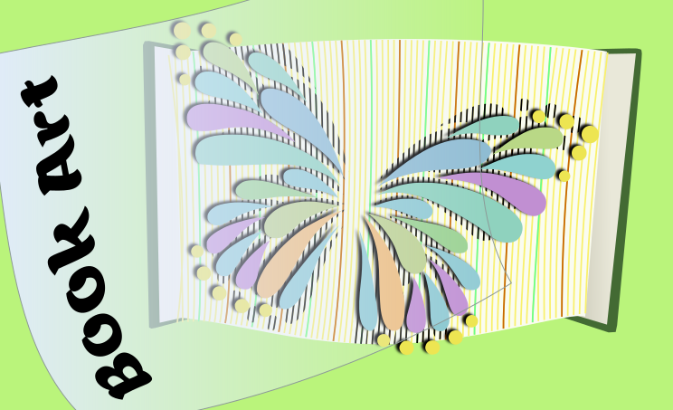
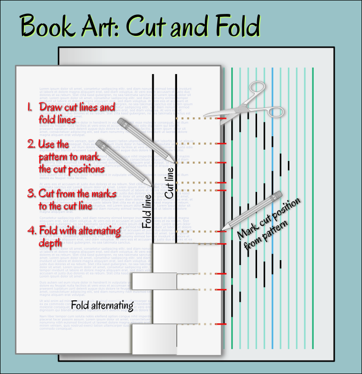

## Inkscape Extension: Book Art

Create patterns for cut and fold book art with Inkscape.

### How To Install

Download the zip file from the [release page](https://github.com/kaalleen/book-art-inkscape-extension/releases/latest) and extract to your Inkscape extensions folder.

Works with Inkscape 1.2

### How To Use The Extension

First import or create your design and scale it to the correct size.

* Open Extensions > Generate from Path > Book Art ...
* Set parameters as necessary, here the important ones:
    * number of pages (start page, end page)
    * book height
    * line distance for your convenience
    * font size
    * units
    
* Click on apply

### How to cut and fold your book

Print the pattern and prepare your tools:

   * book and the printed pattern
   * pencil
   * ruler or triangle ruler
   * scissors

Now draw two vertical lines on every page of the book:

   * cut line: to where you cut
   * fold line: to where you fold

Use the pattern to mark the cut points. Cut horizontally from the mark to the cut line. Then fold. You can either fold the pattern to the inside or to the outside to achieve a different effect.

